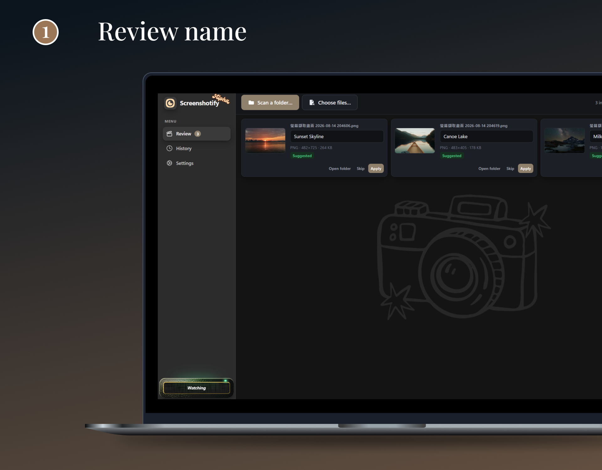
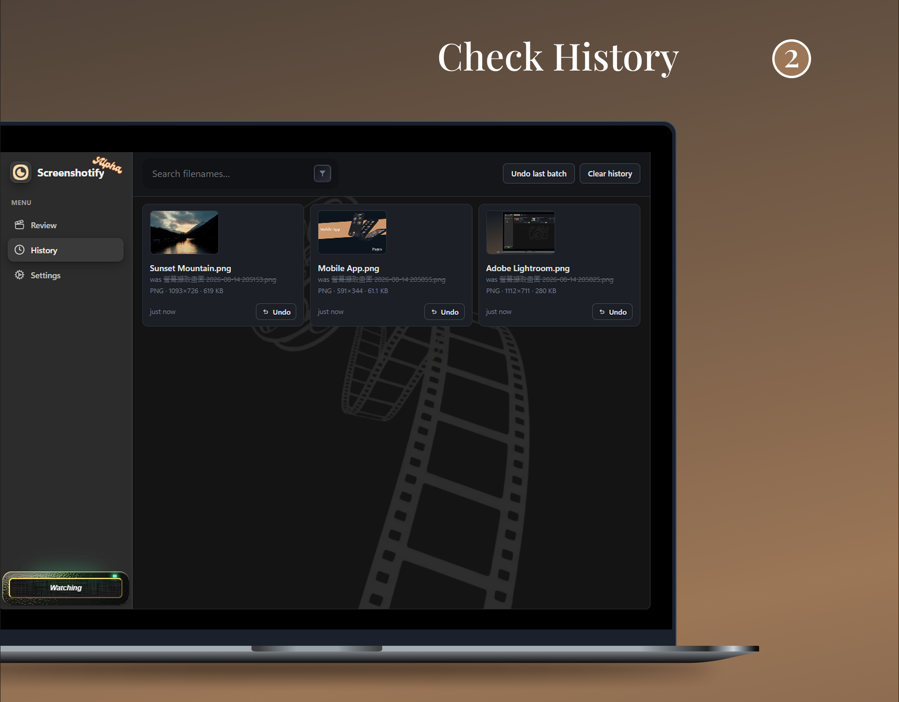
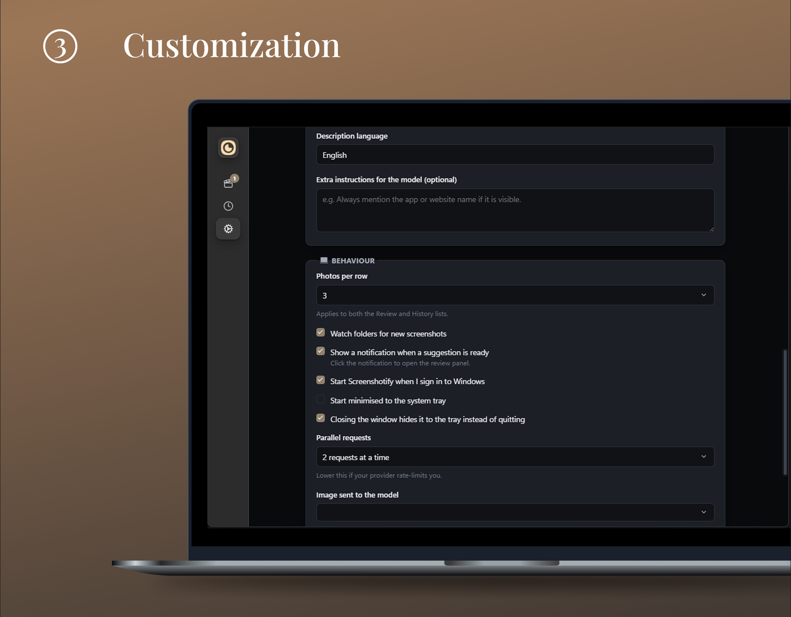

<div align="center">


# Screenshotify

**Your screenshots folder, but the filenames make sense.**

Screenshotify sits in the Windows tray, notices new screenshots, and asks an AI model
of your choosing for a filename that describes what is actually on screen.
Nothing is renamed until you say so.

### [ Download for Windows](https://github.com/shaqkao/screenshotify/releases/latest)

Free · open source · MIT · bring your own API key

</div>

---

<div align="center">







</div>

## Why

`Screenshot 2026-08-12 143507.png` tells you **NOTHING**. Six months later you have
four hundred of them and no way to find the one you need.

Existing AI renamers are manual batch tools, subscription products, or both.
Screenshotify is the combination that did not exist: **open source, free, focused on
screenshots, and genuinely watching in the background.**

## What it does

- **Watches your screenshot folders.** New screenshots are picked up
  automatically, once the file has finished being written.
- **Suggests, never assumes.** Every suggestion lands in a review list. Confirm,
  edit, or skip. Undo is always available, including after a restart.
- **Renames what you already have.** Point it at a folder of old screenshots and
  it queues every one of them into the same review list.
- **Runs on the model you choose.** Any OpenAI-compatible endpoint, including
  ones running entirely on your own machine.
- **Stays out of the way.** Tray icon, optional start-at-login, close-to-tray.

## Bring your own model

Screenshotify has no backend and no account. You point it at an endpoint and it uses
your key. Anything OpenAI-compatible that accepts image input works:

| Provider | Base URL | Notes |
| --- | --- | --- |
| OpenAI | `https://api.openai.com/v1` | `gpt-4o-mini` is a good default |
| OpenRouter | `https://openrouter.ai/api/v1` | One key, many vision models |
| Ollama | `http://localhost:11434/v1` | Fully local, no key needed |
| LM Studio | `http://localhost:1234/v1` | Fully local, no key needed |
| vLLM / LiteLLM | your own URL | Anything speaking the same API |

The model field is free text — type whatever your endpoint accepts. It must be a
model that can see images (`gpt-4o-mini`, `qwen2.5vl`, `llava`, …).

> "OpenAI-compatible" is a loose promise, and plenty of endpoints accept the chat
> schema while rejecting images. **Settings → Test connection** sends a small real
> image so you find out immediately rather than on your first screenshot.

### Running it entirely offline

Point the base URL at Ollama or LM Studio and no image ever leaves your machine.
This is the same feature as "local model support" in other tools — Screenshotify just
does not try to manage the model runtime for you.

## Privacy

- Screenshots are sent **only** to the endpoint you configure, only when a
  suggestion is needed, and downscaled first (1024 px longest edge by default).
- Your API key is stored in the **Windows Credential Manager**, never in a config
  file, and is never handed back to the app's UI layer — requests are made from
  the Rust process.
- No telemetry, no analytics, no accounts, no server.

## Installing

Download the installer from the [latest release](https://github.com/shaqkao/screenshotify/releases/latest)
and run it. That single file is everything — there is no runtime to install
alongside it, no Node, no Python, no account.

Screenshotify is a native app built with [Tauri](https://tauri.app/), so it renders its
UI with the WebView2 component Windows 10 and 11 already ship, instead of
bundling a copy of Chromium the way an Electron app does. That is the difference
between a download measured in single-digit megabytes and one measured in
hundreds. On the rare machine without WebView2, the installer fetches it
automatically.

### About the SmartScreen warning

Screenshotify is not yet code-signed, so Windows will show
**"Windows protected your PC"** the first time you run the installer. This is
normal for new, unsigned open-source software — the warning is about the absence
of a paid certificate, not about anything found in the file.

To continue: click **More info**, then **Run anyway**.

A code-signing certificate through the
[SignPath Foundation](https://signpath.org/) free-for-open-source programme is
being applied for; once granted, releases will be signed automatically and this
warning will disappear.

## Using it

1. **Settings → AI provider** — set the base URL, key and model, then
   **Test connection**.
2. **Settings → Watched folders** — *Use default Screenshots folder* usually
   finds the right one.
3. Take a screenshot. A notification appears; open Screenshotify from the tray to
   review the suggested name.
4. **Review** — press Enter or click **Apply** on a row, or **Apply all**.
5. Got an existing pile? **Review → Scan a folder…**

### Naming options

Filename style (`kebab-case`, `snake_case`, `Title Case`, `camelCase`, spaces),
an optional date prefix taken from the file's own timestamp, a word limit, the
description language, and free-form extra instructions for the model — all under
**Settings → Naming**.

## Building from source

Only needed if you want to modify Screenshotify — users never install any of this.
Compiling a native Windows binary needs a C++ linker and the Windows SDK, so
expect roughly 5 GB of one-off toolchain:

- [Node.js](https://nodejs.org/) 20 or newer
- [Rust](https://rustup.rs/) (stable, MSVC toolchain)
- **Visual Studio Build Tools** — the `Microsoft.VisualStudio.Component.VC.Tools.x86.x64`
  component is enough; the full *Desktop development with C++* workload also
  works but installs considerably more than this project uses
- **Windows SDK** (10.0.22621 or newer)
- WebView2 runtime (already present on Windows 10/11)

```powershell
winget install Rustlang.Rustup
winget install Microsoft.VisualStudio.2022.BuildTools --override `
  "--quiet --wait --norestart --add Microsoft.VisualStudio.Component.VC.Tools.x86.x64 --add Microsoft.VisualStudio.Component.Windows11SDK.26100"
rustup default stable
```

```bash
npm install
npm run start     # dev build with hot reload
npm test          # unit tests for the filename pipeline
npm run release   # produces src-tauri/target/release/bundle/nsis/*.exe
```

The frontend is plain HTML/CSS/JS through Vite; the backend is Rust via
[Tauri v2](https://tauri.app/).

### Project layout

```
index.html            single-window UI shell
src/
  main.js             bootstrap, tray/watcher events, settings form
  queue.js            review queue + bounded-concurrency AI calls
  review.js           the review list and applying renames
  history.js          persisted rename log, powers undo
  naming.js           model output -> safe Windows filename
  naming.test.js      unit tests for the above (node --test)
  settings.js         persisted settings + credential-manager key access
src-tauri/src/
  lib.rs              commands, tray, window behaviour
  watcher.rs          folder watching with write-completion detection
  ai.rs               OpenAI-compatible vision requests
  imaging.rs          downscale + JPEG + base64
  files.rs            scanning, collision-safe rename, undo
  secrets.rs          Windows Credential Manager
```

## Not in v1

Deliberately left out to keep the first release shippable:

- Managing local models for you (installing, downloading, VRAM detection) —
  point the base URL at Ollama or LM Studio instead
- Microsoft Store distribution
- File types other than images

These may be implemented in the future, who knows?

## Contributing

Issues and pull requests are welcome. The most useful contributions right now are
real-world reports of endpoints or models that misbehave, and screenshots that
produce bad names.

## License

MIT — see [LICENSE](LICENSE).
